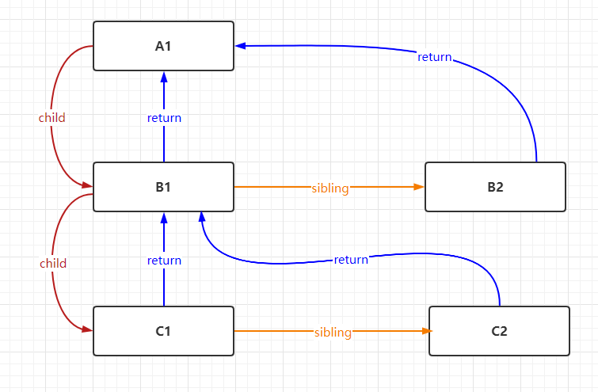
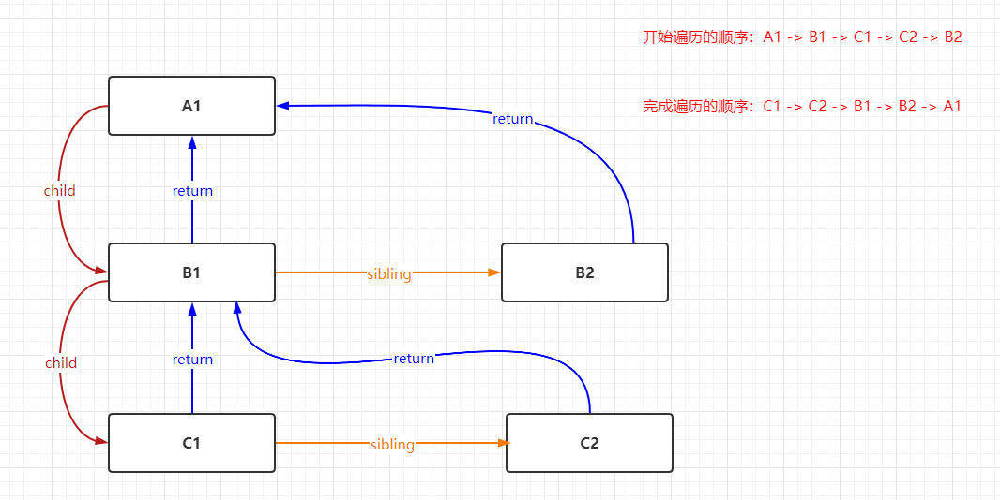

## 有React Fiber 为什么不需要Vue Fiber
我们有一下DOM结构,之后内容的讲解以这个DOM结构为例子

```html
    <div id="A1">
        <div id="B1">
            <div id="C1"><div>
            <div id="C2"><div>
        <div id="B2"><div>
    </div>
```

在说这个问题之前 我们先来了解下React Fiber

### 为什么会有Fiber的出现
假设一个场景，我们需要向视图中渲染3000个li.

```javascript
function App() {
  const len = 3000;
  return (
    <ul>
      {Array(len).fill(0).map((_, i) => <li>{i}</li>)}
    </ul>
  );
}

const rootEl = document.querySelector("#root");
ReactDOM.render(<App/>, rootEl);  
```
我们知道主流浏览器的刷新频率是60HZ，也就是 16.67ms刷新一次（1000ms/60）,在这16.67ms需要处理完成以下工作

```
JS脚本执行 ---- 样式布局 ---- 样式绘制
```
而`GUI渲染进程`和`js线程`是互斥的，所以以上这些工作不能同时执行。假想一下如果JS脚本执行超过`16.67ms`，就没有时间执行*样式布局*和*样式绘制了*。这样就会导致页面掉帧，造成卡顿。

那如何解决这个问题了？

采用`Fiber架构`将*同步的更新*变为*可中断的异步更新*，在没有Fiber的时候，我们是用*递归*的方式来更新渲染虚拟DOM的，递归是不能中断的。而Fiber是采用单链表的形式,可以中断


### 什么是Fiber

* Fiber是一个执行单位，每次执行完一个执行单元，每次执行完一个执行单元，React就会
检查还剩多少时间，如果没有时间就讲控制权转让给浏览器。

`React Fiber`是通过`requestIdleCallback`这个api去控制组件的渲染的。

`requesetIdleCallback`是一个属于宏任务的回调，就像`setTimeout`一样。不同的是，`setTimeout`的执行时机由我们传入的回调时间去控制，`requesetIdleCallback`是受屏幕的刷新率去控制。本文不对这部分做深入探讨，只需要知道它每隔16ms会被调用一次，它的回调函数可以获取本次可以执行的时间，每一个16ms除了`requesetIdleCallback`的回调之外，还有其他工作，所以能使用的时间是不确定的，但只要时间到了，就会停下节点的遍历。

但由于兼容性不好，加上该回调函数被调用的频率太低，react实际使用的是一个`polyfill(自己实现的api)`，而不是`requestIdleCallback`。


* Fiber是一个数据结构，React目前的做法是使用链表每个虚拟节点内部表示为一个Fiber。用`child`来表示子节点，用`sibling`表示兄弟节点，用`return`父节点。这样连成了一个`Fiber树`。如下图所示：



节点以树的形式被组织起来，每个节点上有多个指针指向子节点，要找到两颗树的变化，最容易想到的办法就是深度优先遍历。

遍历规则如下：

* 从顶点节点开始遍历
* 如果有第一个儿子，先遍历第一个儿子
* 如果没有第一个儿子，标志着此节点遍历完成
* 如果没有弟弟（silbing）遍历弟弟
* 如果没有下一个弟弟，返回父节点表示完成父节点。如果有叔叔（父亲的弟弟）遍历叔叔

总的规则是先儿子后弟弟再叔叔，辈分越小越优先

什么时候节点遍历完成？
没有子节点，或者所有子节点都遍历完成。

根据这个遍历规则，我们可以知道Fiber树的遍历顺序和完成顺序。



通过这个结构我们看出来，当遍历发生中断的时候。只要保留下当前节点的索引，断点是可以恢复的————因为每个节点都保存着对其父节点的索引。

下面我们来看下使用Fiber和不使用Fiber的变化。


上面是使用旧的react时，获得每一帧的时间点，下面是使用fiber架构时，获得每一帧的时间点，因为组件渲染被分片，完成一帧更新的时间点反而被推后了，我们把一些时间片去处理用户响应了。
这里要注意，不会出现“一次组件渲染没有完成，页面部分渲染更新”的情况，react会保证每次更新都是完整的


### React渲染和Vue渲染的区别

* React渲染更新是`自顶向下的渲染更新`（该组件以及该组件的子组件全部需要渲染）
* Vue渲染更新是使用`Object.definePrototype`对数据的设置（`setter`）和获取（`getter`）做了劫持，`vue`能准确知道视图模板中哪一块用到了这个数据，并且在这个数据修改时，告诉这个视图，你需要重新渲染。


### React不如Vue?
我们现在已经知道了react fiber是在弥补更新时“无脑”刷新，不够精确带来的缺陷。这是不是能说明react性能更差呢？
并不是。孰优孰劣是一个很有争议的话题，在此不做评价。因为vue实现精准更新也是有代价的，一方面是需要给每一个组件配置一个“监视器”，管理着视图的依赖收集和数据更新时的发布通知，这对性能同样是有消耗的；另一方面vue能实现依赖收集得益于它的模版语法，实现静态编译，这是使用更灵活的JSX语法的react做不到的。
在react fiber出现之前，react也提供了PureComponent、shouldComponentUpdate、useMemo,useCallback等方法给我们，来声明哪些是不需要连带更新子组件。

所以为啥React需要Fiber，而Vue不需要

* react因为先天的不足——无法精确更新，所以需要react fiber把组件渲染工作切片；而vue基于数据劫持，更新粒度很小，没有这个压力；
* react fiber这种数据结构使得节点可以回溯到其父节点，只要保留下中断的节点索引，就可以恢复之前的工作进度

### React Fiber的实现


